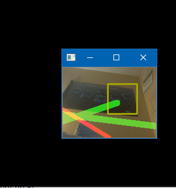

Raspberry Pi Setup
--------
__Note:__ only connect the camera module when the Pi is __unplugged__
1. [Flash __Raspbian__ onto the Pi's SD Card with the ___Raspberry Pi Imager___](https://www.raspberrypi.org/downloads/)
2. __Connect hardware__ and boot up Pi
3. Open the __console__ and install __OpenCV__:
```console
sudo apt update
sudo apt install python3-opencv
```
4. Enable `camera` in `Preferences > Raspberry Pi Configuration > Interfaces` [(tutorial)](https://projects.raspberrypi.org/en/projects/getting-started-with-picamera/2)
5. __Reboot__ the Pi
6. Test everything by executing __RPilaneDetection.py__ (it's in this directory)

Executables
--------

* __RPilaneDetection.py__: the simple lane-detection script to be run locally on the Pi
* __RPilaneDetection_withTimeTest.py__: local script that also evaluates time taken by each function
__Press 'Q' to exit the camera-preview__

Stop Sign Detection
----------
This part is _jenky_. It doesn't use a __neural network__, but a simple `matchTemplate()` function from [OpenCV](https://docs.opencv.org/2.4/doc/tutorials/imgproc/histograms/template_matching/template_matching.html). The easist potential solution is experimenting with the `threshold` variable. The higher you set it, the more strict the algorithm is with what it considers a _stop sign_. Hopefully this quick fix will be enough. __Below is an example of a false-positive with `threshold = 0.4`__.



Lane Detection Image Processing
--------
Source-code by [David Tian](https://towardsdatascience.com/deeppicar-part-4-lane-following-via-opencv-737dd9e47c96)

The sequence of image-processing filters are shown programmatically by setting `_SHOW_IMAGE = True` 

1. input frame
2. blue-color filter
3. Canny Edge Detector
4. (un-pictured) mask that eliminates top-half of frame
5. Hough Line Transform
6. Derive lane-lines
7. Draw heading


Performance Test
---------------------
Time spent in each function (seconds):
* _detect_edges_:  0.007003
* _region_of_interest_:  0.0004969
* _detect_line_segments_:  0.0110026
* _make_points_: 1.81e-05
* _make_points_: 3.49e-05
* _average_slope_intercept_ : 0.0738952 <== key bottleneckw
* _detect_lane_:  0.1039518
* _compute_steering_angle_ : 2.09e-05
* _stabilize_steering_angle_ : 8.8e-06

Known Errors
------------------------
```
E: Unable to acquire the dpkg frontend lock ...
```
According to Matteo, this error occurs a lot in Linux when other processes are accessing __apt__. So just close all your terminal-windows and try again. Worst case, restart the Pi.
